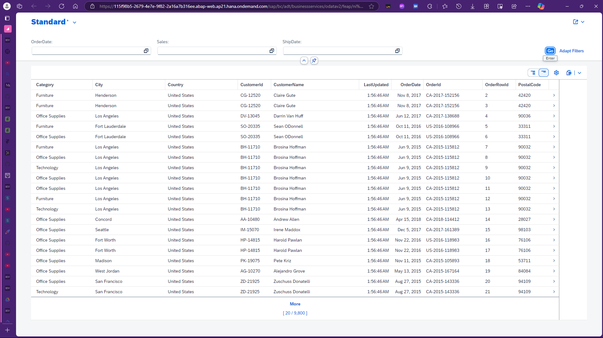
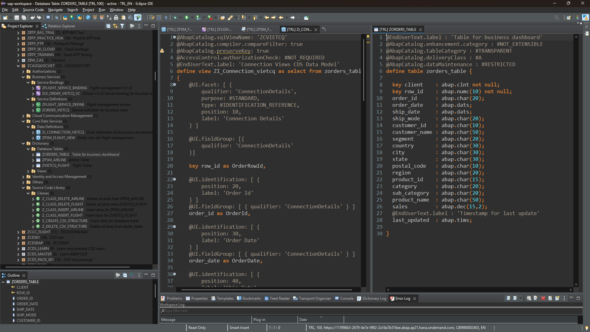
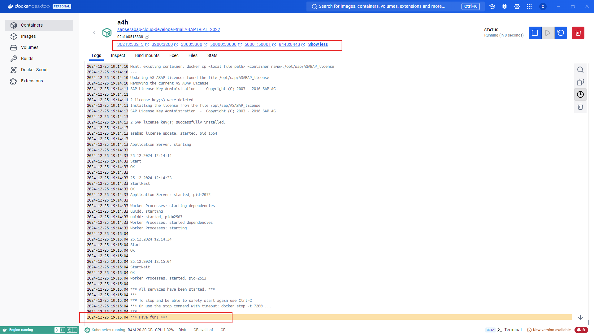

# SAP ABAP Data Management Project

## Overview

This project is designed to manage and analyze sales orders within an SAP environment using ABAP Core Data Services (CDS). It includes the creation of database tables, CDS views, business services, and integration with SAP Fiori for an enhanced user interface. Docker is utilized to streamline the development and deployment processes.

## Table of Contents

1. [Setup Docker](#1-setup-docker)
2. [AH4 License Configuration](#2-ah4-license-configuration)
3. [Run Docker](#3-run-docker)
4. [Download and Setup Eclipse to Connect with AS](#4-download-and-setup-eclipse-to-connect-with-as)
5. [Create Database Table](#5-create-database-table)
6. [Create CDS View](#6-create-cds-view)
7. [Create Business Service](#7-create-business-service)
8. [Configure Service Bindings](#8-configure-service-bindings)
9. [Test the Business Service](#9-test-the-business-service)
10. [Deploy the Business Service](#10-deploy-the-business-service)
11. [Monitor and Maintain Services](#11-monitor-and-maintain-services)
12. [Folder Structure](#12-folder-structure)
13. [Additional Resources](#13-additional-resources)

## Development Workspace

The development workspace is set up in Visual Studio Code with integrated unit testing, an output pane, and a terminal for seamless development. Below is a snapshot of the workspace environment:

## 1. Setup Docker

Refer to [Resources/document.md](Resources/document.md#1-setup-docker) for detailed instructions.

## 2. AH4 License Configuration

Refer to [Resources/document.md](Resources/document.md#2-ah4-license-configuration) for detailed instructions.

## 3. Run Docker

Refer to [Resources/document.md](Resources/document.md#3-run-docker) for detailed instructions.

## 4. Download and Setup Eclipse to Connect with AS

Refer to [Resources/document.md](Resources/document.md#4-download-and-setup-eclipse-to-connect-with-as) for detailed instructions.

## 5. Create Database Table

Refer to [Resources/document.md](Resources/document.md#5-create-database-table) for detailed instructions.

## 6. Create CDS View

Refer to [Resources/document.md](Resources/document.md#6-create-cds-view) for detailed instructions.

## 7. Create Business Service

Refer to [Resources/document.md](Resources/document.md#7-create-business-service) for detailed instructions.

## 8. Configure Service Bindings

Refer to [Resources/document.md](Resources/document.md#8-configure-service-bindings) for detailed instructions.

## 9. Test the Business Service

Refer to [Resources/document.md](Resources/document.md#9-test-the-business-service) for detailed instructions.

## 10. Deploy the Business Service

Refer to [Resources/document.md](Resources/document.md#10-deploy-the-business-service) for detailed instructions.

## 11. Monitor and Maintain Services

Refer to [Resources/document.md](Resources/document.md#11-monitor-and-maintain-services) for detailed instructions.

## 12. Additional Resources

- [SAP Fiori Documentation](https://help.sap.com/viewer/product/SAP_FIORI)
- [OData Protocol Documentation](https://www.odata.org/documentation/)
- [Docker Documentation](https://docs.docker.com/)

## Usage

For detailed instructions on setting up and using this project, please refer to the [project documentation](Resources/document.md).

## Contributing

Contributions are welcome! Please follow the guidelines in the [CONTRIBUTING.md](CONTRIBUTING.md) file.

## License

This project is licensed under the [LICENSE](LICENSE) file.